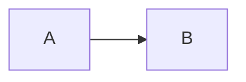

# Duplicate Heading

# Duplicate Heading

# Café — 日本語

Markdown **strong**, *emphasis*, ~~strike~~, `inline`, <https://example.test>, and [relative](../links/target.md).

HTML block:

<section><h2>HTML heading</h2><p>Mixed <em>inline</em> HTML.</p><table><tr><th>A</th><th>B</th></tr><tr><td>1</td><td>2</td></tr></table></section>

- outer
  - nested
    1. deep ordered
    2. second
- [ ] read-only task

```python
print("python")
```

```js
const answer = 42;
```

```ts
const typed: number = 42;
```

```jsx
<div>jsx</div>
```

```tsx
const View = () => <div>tsx</div>;
```

```bash
echo bash
```

```sql
SELECT 1;
```

```rust
fn main() {}
```

```go
package main
```

```c
int main(void) { return 0; }
```

```cpp
int main() { return 0; }
```

```java
class Main {}
```

```csharp
class Main {}
```

```ruby
puts :ruby
```

```php
<?php echo "php";
```

```swift
let value = 1
```

```kotlin
val value = 1
```

```html
<strong>html</strong>
```

```css
body { color: red; }
```

```json
{"ok": true}
```

```yaml
ok: true
```

```toml
ok = true
```

```markdown
# nested markdown
```

```unknown
plain fence
```

     

Inline math: $x^2$.

Block math:

$$
\\frac{1}{2}
$$


